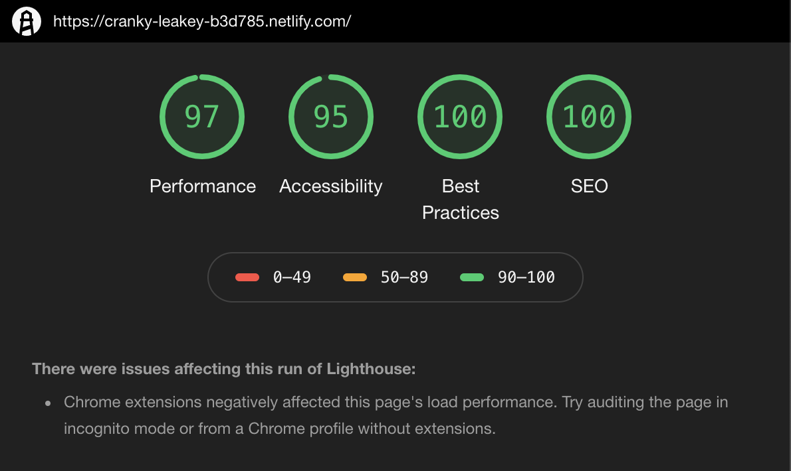

# The Catasthrope

## [Demo](https://cranky-leakey-b3d785.netlify.com)

This landing page website is highly optimized, you can see the web audit score below:

To achieve the above values, some of the things that I did were:

1. Compress all images
2. Using `webp` image extension
3. Cropping the image to reduce the size of the image
4. Etc.

## Reference

1. https://developers.google.com/speed/webp/docs/compression
